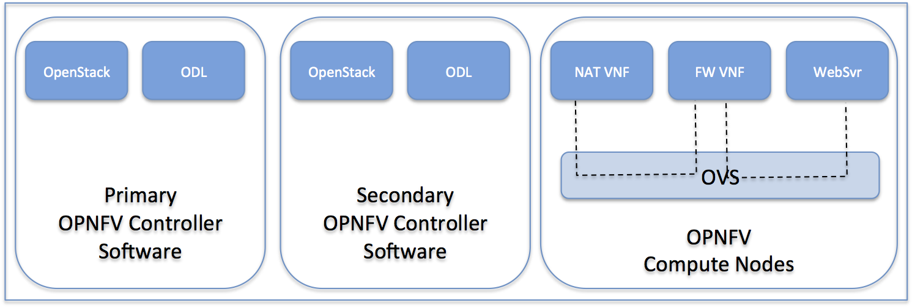

.. topic:: Project: OPNFV - Base system functionality testing 

  * Proposed name for the project: **OPNFV – Base system functionality testing**
  * Proposed name for the repository: **functest**
  * Project Categories: Integration & Testing

Project description
-----------------------

        Project “OPNFV – Base system functionality testing” will provide comprehensive testing methodology, test suites and test cases to test and verify OPNFV Platform functionality that covers the  VIM and NFVI components. 

        This project uses a "tops-down" approach that will start with chosen ETSI NFV use-case/s and open source VNFs for the functional testing. The approach taken will be to 
  * break down the use-case into simple operations and functions required. 
  * specify necessary network topologies 
  * develop necessary test traffic and traffic profiles. Ideally VNFs will be Open Source however proprietary VNFs may also be used as needed. 

        This project will develop test suites that cover detailed functional test cases, test methodologies and platform configurations which will be documented and maintained in a repository for use by other OPNFV testing projects and the community in general.  Developing test suites will also help lay the foundation for a test automation framework that in future can be used by the continuation integration (CI) project (Octopus). We envisage that certain VNF deployment use-cases could be automatically tested as an optional step of the CI process.

        Approach 

        The project targets testing of the OPNFV platform in a hosted test-bed environment (i.e. using the OPNFV test labs world wide). It will leverage output of the "Get started!" project. 

        The picture below outlines the main setup of “OPNFV – Base system functionality testing" project. 

Scope
--------

        “OPNFV – Base system functionality testing” will deliver a functional testing framework along with a set of test suites and test cases to test and verify the functionality OPNFV platform. The testing framework (tools, test-cases, etc.) are also intended to be used by the CI framework for the purpose of qualifying the OPNFV platform on bare metal servers. In this context, OPNFV Tester will use open source VNF components.

        Functional testing includes: 

  * Testing the installer, setup and the configuration of the OPNFV platform hardware and software.
  * Testing the basic VIM functionality that includes tenant, user CRUD operations, VNF Image CRUD operations etc.
  * Testing the VIM functionality to support VNF operations (create, modify, grow, shrink, destroy)        
  * Testing the VIM functionality to support basic VNF network connectivity
  * Testing the inter working between the VIM and the SDN controller.
  * Testing the NFVI functionality as a black box to ensure that it meets the VIM requirements.

        The project requires the following components:

  * OPNFV Lab setup with complete access to a set of Bare metal servers for Controller and Compute nodes (minimum configuration: 1x installer server, 2x controller node servers, 3x compute node servers); associated switches and routers.
  * OPNFV platform software bundle from the repository that includes several upstream software components.
  * OPNFV "Get Started!" software bundles that includes the installer
  * Open Source VNF Open-WRT
  * Open Source VNF Snort
  * Open Source Apache Web Server in Ubuntu 14.04
  * Open Source HAProxy
  * Tempest framework and Robot Framework

Functional Testing covered
---------------------------

The following links provide the detailed test suites and drill down into the test suites/test cases to cover the functional testing.

.. vPE Function Test Suites: https://wiki.opnfv.org/virtual_provider_edge#generic_functional_testing

.. vIMS Functional Testing: https://wiki.opnfv.org/vIMS_functional_testing

        The above test suites/cases are automated via Robot/Jenkins.

Dependencies
-------------

  * The project is a contributor to project “Octopus”.
  * The project leverages  "Boot Strap/Get Started"
  * The project relies on the following upstream projects:
    * OpenStack Juno release: Components: Nova, Glance, Keystone, Horizon, Neutron, Ceilometer, Heat
    * OpenDaylight Helium release: Components: MDSAL, OVSDB, RESTCONF, ML2 plugin/ODL Neutron drivers
    * Installer: TBD
    * Puppet (for instance configuration)
    * QEMU/KVM
    * OpenWRT (as example VNF - for routing, firewall, NAT)
    * Snort (as example VNF - for IDS)
    * Linux   Ubuntu 14.04/Centos 7 distribution

Key Project Facts
------------------

{{scrape>https://gerrit.opnfv.org/gerrit/gitweb?p=functest.git;a=blob_plain;f=INFO;}}

  * Additional Contributors  
    * Frank Brockners (fbrockne@cisco.com)
    * Sajeev Manikkoth (sajeevmanikkoth@gmail.com)
    * Jun Li (yuyijun@huawei.com)
    * Sean Chen (s.chen@huawei.com)
    * Rajeev Seth (rseth@sonusnet.com)
    * Kevin Riley (kriley@sonusnet.com)
    * Justin Hart (jhart@sonusnet.com) 

 
Planned deliverables
---------------------

Project deliverable:
The project delivers the following components:
 
  * Documentation of Test Suites and test cases that cover the OPNFV platform functionality testing including pass/fail criteria.
  * Test software and scripts for testing OPNFV Platform functionality that is essentially broken down into two main suites as follows:
    * OPNFV Platform Smoke test suite:  A sanity testing suite for basic verification of the platform.
    * OPNFV Platform Regression test suite: A comprehensive collection of detailed test suites.
  * Automated Test Framework based on Tempest/Robot/Jenkins, with necessary scripts and tools to automatically test and verify OPNFV functionality

Proposed Release Schedule
--------------------------

OPNFV release #1.

